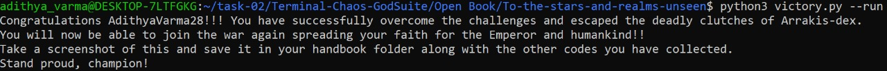

## Terminal-Chaos

This task was a bit tricky, but I was able to complete it as I was familiar with Linux commands(I did Over the Wire up to level 10 in my first year). I started by cloning the repository using `git clone` and created a directory using `mkdir`. I used `nano` to store the codes.

## Part-1

This part was simple. I followed the instructions given and used the `find` command to find the parchment.

`find . -name "*parchment*"`

## Part-2

I used the `git branch -a` command to find out the branches, then I switched to the **light realm** using `git checkout`.

Once in the light realm, I searched and found **Key to Spell Production** and **Light Book is in the Capital**. I also discovered that the two herbs were Mistveil and Moonbloom by using the grep command:

`grep -rl "holy.*good\|good.*holy" .`

After parrying the dragon at 1 sec and using the holy spell **LnnmknnlLhrsdhk**, I found the Light Book and the **Celestial Veil Amulet**.

## Part-3

This part was relatively easy. All I did was to find the chest and open it using the **Celestial Veil Amulet** 

`find . -name "*chest*"`

## Part-4

After combining all the codes obtained so far and decoding the base64 string I obtainded the GodSuite repository: **https://github.com/amansxcalibur/Terminal-Chaos-GodSuite%**

`echo 'aHR0cHM6Ly9naXRodWIuY29tL2FtYW5zeGNhbGlidXIvVGVybWluYWwtQ2hhb3MtR29kU3VpdGU=' | base64 -d`

## Part-5

After checking all the commits, I found a code. Thinking it might be base64 encoded,I checked it and got access to the **To the stars and realms unseen** repository in which I ran the victory.py file.

